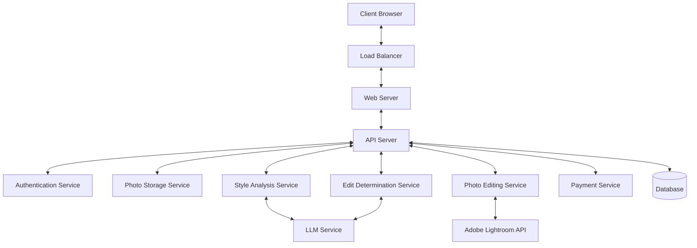
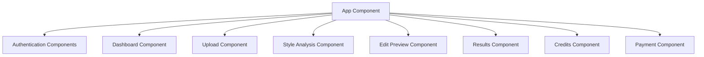
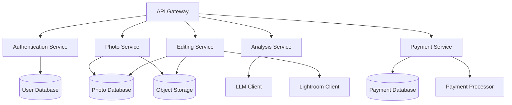
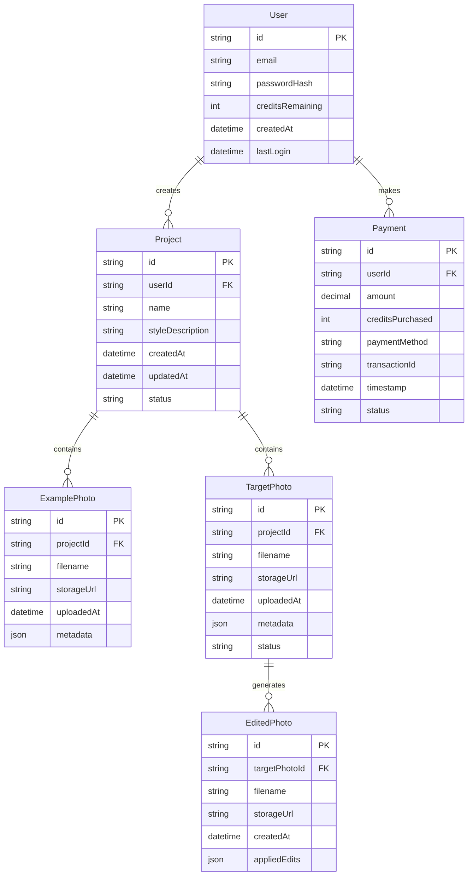

# Photo Style Transfer - System Design

## 1. System Architecture Overview

The Photo Style Transfer application will follow a modern web application architecture with the following key components:



### 1.1 Key Components

1. **Client**: Browser-based frontend application built with modern web technologies.
2. **Load Balancer**: Distributes incoming traffic across multiple web server instances.
3. **Web Server**: Serves static content and routes API requests.
4. **API Server**: Handles business logic and coordinates between services.
5. **Authentication Service**: Manages user registration, login, and session management.
6. **Photo Storage Service**: Handles photo upload, storage, and retrieval.
7. **Style Analysis Service**: Analyzes example photos to determine style characteristics.
8. **Edit Determination Service**: Determines appropriate Lightroom adjustments for photos.
9. **Photo Editing Service**: Applies determined adjustments to photos using Lightroom API.
10. **Payment Service**: Handles credit purchases and payment processing.
11. **Database**: Stores user data, photo metadata, and transaction records.
12. **LLM Service**: Provides AI capabilities for photo analysis and edit determination.
13. **Adobe Lightroom API**: External service for photo editing.

## 2. Component Details

### 2.1 Frontend Architecture

The frontend will be built as a single-page application (SPA) using a modern JavaScript framework (React, Vue, or Angular) with the following key features:



#### Key Frontend Components:

1. **Authentication Components**: Login, registration, and password reset forms.
2. **Dashboard Component**: Main user interface after login, showing user's projects and credits.
3. **Upload Component**: Interface for uploading example photos and photos to be edited.
4. **Style Analysis Component**: Displays the identified style and allows for user feedback.
5. **Edit Preview Component**: Shows preview of edits and allows for adjustments.
6. **Results Component**: Displays final edited photos with download options.
7. **Credits Component**: Shows user's remaining credits and usage history.
8. **Payment Component**: Interface for purchasing additional credits.

### 2.2 Backend Architecture

The backend will follow a microservices architecture with the following services:



#### Key Backend Services:

1. **API Gateway**: Routes requests to appropriate services and handles cross-cutting concerns.
2. **Authentication Service**: Manages user authentication and authorization.
3. **Photo Service**: Handles photo upload, storage, and retrieval.
4. **Analysis Service**: Analyzes photos using LLM to determine style characteristics.
5. **Editing Service**: Determines and applies edits to photos using Lightroom API.
6. **Payment Service**: Manages credit system and payment processing.

### 2.3 Data Model



## 3. Technical Stack

### 3.1 Frontend
- **Framework**: React.js with TypeScript
- **State Management**: Redux or Context API
- **UI Components**: Material-UI or Tailwind CSS
- **HTTP Client**: Axios
- **Build Tools**: Webpack, Babel
- **Testing**: Jest, React Testing Library

### 3.2 Backend
- **API Framework**: Node.js with Express or NestJS
- **Authentication**: JWT (JSON Web Tokens)
- **Database**: PostgreSQL for relational data
- **Object Storage**: AWS S3 or equivalent for photo storage
- **Caching**: Redis
- **Message Queue**: RabbitMQ or AWS SQS for asynchronous processing
- **Containerization**: Docker
- **Orchestration**: Kubernetes or AWS ECS
- **CI/CD**: GitHub Actions or Jenkins

### 3.3 External Services
- **LLM Service**: OpenAI API (GPT-4 Vision) or equivalent
- **Photo Editing**: Adobe Lightroom API
- **Payment Processing**: Stripe or PayPal
- **Email Service**: SendGrid or AWS SES
- **Monitoring**: Prometheus, Grafana
- **Logging**: ELK Stack (Elasticsearch, Logstash, Kibana)

## 4. API Design

### 4.1 RESTful API Endpoints

#### Authentication API
- `POST /api/auth/register` - Register a new user
- `POST /api/auth/login` - Log in a user
- `POST /api/auth/logout` - Log out a user
- `POST /api/auth/reset-password` - Request password reset
- `POST /api/auth/reset-password/:token` - Reset password with token

#### User API
- `GET /api/users/me` - Get current user information
- `PUT /api/users/me` - Update user information
- `GET /api/users/me/credits` - Get user credit information
- `GET /api/users/me/projects` - Get user projects

#### Project API
- `POST /api/projects` - Create a new project
- `GET /api/projects` - List user's projects
- `GET /api/projects/:id` - Get project details
- `PUT /api/projects/:id` - Update project
- `DELETE /api/projects/:id` - Delete project

#### Photo API
- `POST /api/projects/:id/example-photos` - Upload example photos
- `GET /api/projects/:id/example-photos` - List example photos
- `DELETE /api/projects/:id/example-photos/:photoId` - Delete example photo
- `POST /api/projects/:id/target-photos` - Upload target photos
- `GET /api/projects/:id/target-photos` - List target photos
- `DELETE /api/projects/:id/target-photos/:photoId` - Delete target photo
- `GET /api/projects/:id/edited-photos` - List edited photos
- `GET /api/projects/:id/edited-photos/:photoId` - Get edited photo
- `GET /api/projects/:id/edited-photos/:photoId/download` - Download edited photo
- `GET /api/projects/:id/edited-photos/download-all` - Download all edited photos

#### Style Analysis API
- `POST /api/projects/:id/analyze-style` - Analyze style of example photos
- `GET /api/projects/:id/style-description` - Get style description
- `PUT /api/projects/:id/style-description` - Update style description based on feedback

#### Editing API
- `POST /api/projects/:id/determine-edits` - Determine edits for target photos
- `POST /api/projects/:id/apply-edits` - Apply determined edits to target photos
- `GET /api/projects/:id/editing-status` - Check status of editing process

#### Payment API
- `GET /api/payments/pricing` - Get pricing information
- `POST /api/payments/create-checkout-session` - Create payment checkout session
- `GET /api/payments/history` - Get payment history
- `POST /api/payments/webhook` - Payment webhook endpoint

### 4.2 API Request/Response Examples

#### Example: Create Project

Request:
```json
POST /api/projects
Content-Type: application/json
Authorization: Bearer <token>

{
  "name": "Wedding Photos Style Transfer",
  "description": "Apply vintage film style to wedding photos"
}
```

Response:
```json
Status: 201 Created
Content-Type: application/json

{
  "id": "proj_123456",
  "name": "Wedding Photos Style Transfer",
  "description": "Apply vintage film style to wedding photos",
  "userId": "user_789012",
  "createdAt": "2025-03-30T07:20:53Z",
  "updatedAt": "2025-03-30T07:20:53Z",
  "status": "created"
}
```

#### Example: Upload Example Photo

Request:
```
POST /api/projects/proj_123456/example-photos
Content-Type: multipart/form-data
Authorization: Bearer <token>

file: <binary data>
```

Response:
```json
Status: 201 Created
Content-Type: application/json

{
  "id": "photo_345678",
  "projectId": "proj_123456",
  "filename": "example_photo.jpg",
  "storageUrl": "https://storage.example.com/photos/example_photo.jpg",
  "uploadedAt": "2025-03-30T07:25:12Z",
  "metadata": {
    "size": 2048576,
    "width": 1920,
    "height": 1080,
    "format": "image/jpeg"
  }
}
```

## 5. Security Considerations

### 5.1 Authentication and Authorization
- Implement JWT-based authentication with appropriate expiration
- Use HTTPS for all communications
- Implement proper authorization checks for all API endpoints
- Store passwords using strong hashing algorithms (bcrypt)
- Implement rate limiting for authentication endpoints

### 5.2 Data Protection
- Encrypt sensitive data at rest
- Implement proper access controls for user data
- Validate and sanitize all user inputs
- Implement CSRF protection
- Set appropriate security headers

### 5.3 API Security
- Implement API rate limiting
- Use API keys for external service authentication
- Securely store and manage API credentials
- Implement proper error handling to prevent information leakage

### 5.4 Payment Security
- Use a reputable payment processor (Stripe, PayPal)
- Never store credit card information
- Implement proper validation for payment webhooks
- Keep payment processing separate from main application logic

## 6. Scalability and Performance

### 6.1 Horizontal Scaling
- Design stateless services that can be scaled horizontally
- Use load balancers to distribute traffic
- Implement auto-scaling based on load

### 6.2 Caching Strategy
- Cache frequently accessed data using Redis
- Implement CDN for static assets
- Use browser caching with appropriate cache headers

### 6.3 Database Optimization
- Implement database indexing for frequently queried fields
- Consider read replicas for read-heavy operations
- Implement connection pooling
- Consider database sharding for very large datasets

### 6.4 Asynchronous Processing
- Use message queues for long-running tasks
- Implement background workers for photo processing
- Provide real-time updates using WebSockets

## 7. Monitoring and Logging

### 7.1 Application Monitoring
- Implement health check endpoints
- Monitor service availability and response times
- Set up alerts for critical issues
- Track error rates and performance metrics

### 7.2 Logging Strategy
- Implement structured logging
- Centralize logs using ELK stack or similar
- Include request IDs for tracing requests across services
- Implement different log levels (debug, info, warn, error)

### 7.3 User Analytics
- Track user engagement metrics
- Monitor conversion rates
- Analyze feature usage
- Implement A/B testing capabilities

## 8. Deployment Strategy

### 8.1 Containerization
- Package each service as a Docker container
- Use Docker Compose for local development
- Implement multi-stage builds for optimized images

### 8.2 Orchestration
- Use Kubernetes or AWS ECS for container orchestration
- Implement rolling updates for zero-downtime deployments
- Use Helm charts for Kubernetes deployments

### 8.3 CI/CD Pipeline
- Implement automated testing in CI pipeline
- Automate deployment process
- Implement environment promotion (dev, staging, production)
- Use infrastructure as code (Terraform, CloudFormation)

### 8.4 Environment Configuration
- Use environment variables for configuration
- Implement secrets management
- Maintain separate configurations for different environments

## 9. Integration with External Services

### 9.1 LLM Integration
- Implement retry logic for API calls
- Handle rate limiting and quotas
- Optimize prompts for efficient token usage
- Implement fallback mechanisms for service unavailability

### 9.2 Adobe Lightroom API Integration
- Implement OAuth authentication flow
- Handle API rate limits
- Implement proper error handling
- Cache API responses where appropriate

### 9.3 Payment Processor Integration
- Implement webhook handling for payment events
- Provide proper error messages for payment failures
- Implement idempotent payment processing
- Handle payment reconciliation

## 10. Future Considerations

### 10.1 Potential Enhancements
- Implement style presets for common photo styles
- Add social sharing capabilities
- Implement batch processing optimizations
- Add support for video style transfer

### 10.2 Scalability Improvements
- Implement more advanced caching strategies
- Consider serverless architecture for certain components
- Optimize database queries and schema
- Implement content delivery optimization

### 10.3 Business Model Evolution
- Consider subscription-based pricing model
- Implement referral program
- Add professional photographer-specific features
- Explore partnerships with photography platforms
